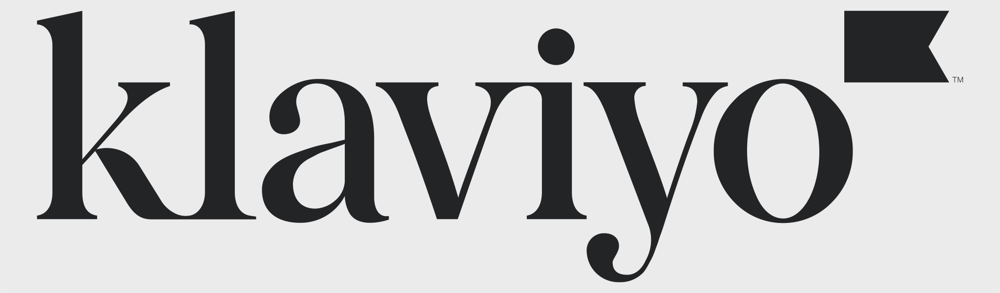
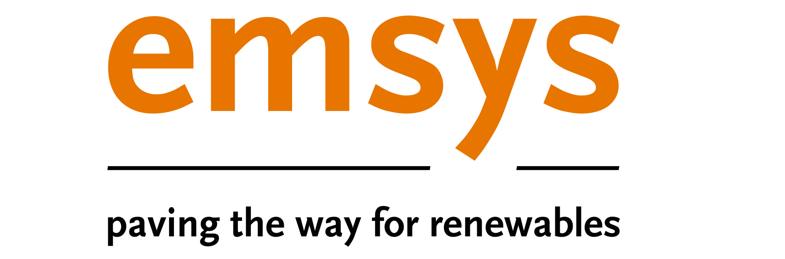

# *attrs*: Classes Without Boilerplate

Release **{sub-ref}`release`**  ([What's new?](changelog.md))

```{include} ../README.md
:start-after: 'teaser-begin -->'
:end-before: '<!-- sponsor-break-begin'
```

<!-- [[[cog
# This is mainly called from RTD's pre_build job!

import pathlib, tomllib

for sponsor in tomllib.loads(pathlib.Path("pyproject.toml").read_text())["tool"]["sponcon"]["sponsors"]:
      print(f'<a href="{sponsor["url"]}"></a>')
]]] -->
<a href="https://www.variomedia.de/"></a>
<a href="https://tidelift.com/?utm_source=lifter&utm_medium=referral&utm_campaign=hynek"></a>
<a href="https://klaviyo.com/"></a>
<a href="https://privacy-solutions.org/"></a>
<a href="https://www.emsys-renewables.com/"></a>
<a href="https://filepreviews.io/"></a>
<a href="https://polar.sh/"></a>
<!-- [[[end]]] -->

```{include} ../README.md
:start-after: 'sponsor-break-end -->'
:end-before: '<!-- teaser-end'
```


## Getting Started

*attrs* is a Python-only package [hosted on PyPI](https://pypi.org/project/attrs/).

The following steps will get you up and running in no time:

- {doc}`overview` will show you a simple example of *attrs* in action and introduce you to its philosophy.
  Afterwards, you can start writing your own classes and understand what drives *attrs*'s design.
- {doc}`examples` will give you a comprehensive tour of *attrs*'s features.
  After reading, you will know about our advanced features and how to use them.
- {doc}`why` gives you a rundown of potential alternatives and why we think *attrs* is still worthwhile -- depending on *your* needs even superior.
- If at any point you get confused by some terminology, please check out our {doc}`glossary`.

If you need any help while getting started, feel free to use the `python-attrs` tag on [Stack Overflow](https://stackoverflow.com/questions/tagged/python-attrs) and someone will surely help you out!


## Day-to-Day Usage

- {doc}`types` help you to write *correct* and *self-documenting* code.
  *attrs* has first class support for them, yet keeps them optional if you’re not convinced!
- Instance initialization is one of *attrs* key feature areas.
  Our goal is to relieve you from writing as much code as possible.
  {doc}`init` gives you an overview what *attrs* has to offer and explains some related philosophies we believe in.
- Comparing and ordering objects is a common task.
  {doc}`comparison` shows you how *attrs* helps you with that and how you can customize it.
- If you want to put objects into sets or use them as keys in dictionaries, they have to be hashable.
  The simplest way to do that is to use frozen classes, but the topic is more complex than it seems and {doc}`hashing` will give you a primer on what to look out for.
- Once you're comfortable with the concepts, our {doc}`api` contains all information you need to use *attrs* to its fullest.
- *attrs* is built for extension from the ground up.
  {doc}`extending` will show you the affordances it offers and how to make it a building block of your own projects.
- Finally, if you're confused by all the `attr.s`, `attr.ib`, `attrs`, `attrib`, `define`, `frozen`, and `field`, head over to {doc}`names` for a very short explanation, and optionally a quick history lesson.


## *attrs* for Enterprise

```{include} ../README.md
:start-after: '### *attrs* for Enterprise'
```

---

## Full Table of Contents

```{toctree}
:maxdepth: 2
:caption: Getting Started

overview
why
examples
```

```{toctree}
:maxdepth: 2
:caption: Explanations

types
init
comparison
hashing
```

```{toctree}
:maxdepth: 2
:caption: Reference

api
api-attr
glossary
```
```{toctree}
:maxdepth: 2
:caption: Advanced

extending
how-does-it-work
```

```{toctree}
:caption: Meta
:maxdepth: 1

names
license
changelog
PyPI <https://pypi.org/project/attrs/>
GitHub <https://github.com/python-attrs/attrs>
Third-party Extensions <https://github.com/python-attrs/attrs/wiki/Extensions-to-attrs>
Contributing <https://github.com/python-attrs/attrs/blob/main/.github/CONTRIBUTING.md>
Funding <https://hynek.me/say-thanks/>
```

[Full Index](genindex)
